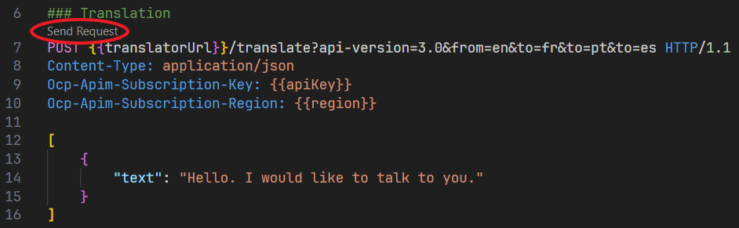
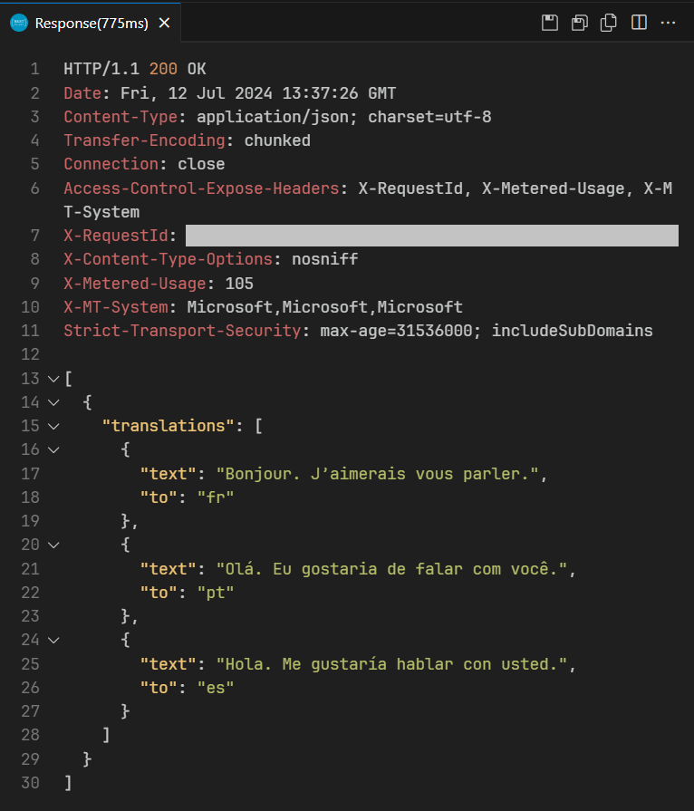
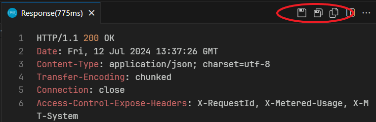

# HTTP requests for the Azure AI services
This is a collection of HTTP requests for the Azure AI services. I gathered them by looking at the official [Microsoft documentation](https://learn.microsoft.com/azure/ai-services/what-are-ai-services). It's not an exhaustive list, so there may be some missing services, but I tried to collect as many as possible. The requests are organized in four categories and several sub-categories:
- Language
  - Azure AI Language
  - Azure AI Translator
- Speech
  - Azure AI Speech
- Vision
  - Azure AI Computer Vision
  - Azure AI Custom Vision
  - Azure AI Face
- Decision
  - Azure AI Anomaly Detector
  - Azure AI Content Moderator
  - Azure AI Personalizer

They are separated in `.http` files which follow the [RFC2616](https://www.w3.org/Protocols/rfc2616/rfc2616-sec5.html) standard.

## How to prepare the environment?
I used [Visual Studio Code](https://code.visualstudio.com/) and the extension [REST Client](https://github.com/Huachao/vscode-restclient). To run the requests, both must be installed in your machine.
1. Create an Azure AI multi-service resource in your [Azure portal](https://portal.azure.com/) (you may follow this [tutorial](https://learn.microsoft.com/en-us/azure/ai-services/multi-service-resource)).
2. Retrieve the key, the endpoint and the region.
3. Create a `settings.json` file inside the `.vscode` folder for the REST Client extension with environment variables. To do this, go to File > Preferences > Settings and inside the Extensions/REST Client tab, click the `Edit in settings.json` button of the `Environment variables` setting. You can also do this by creating a file manually that looks like this:
   ```json
   {
        "rest-client.environmentVariables": {
            
            "$shared": {}
        }
    }
   ```
4. Create three new environment variables called `baseUrl`, `apiKey` and `region`.
   ```json
    {
        "rest-client.environmentVariables": {
            
            "$shared": {
                "baseUrl": "",
                "apiKey": "",
                "region": ""
            }
        }
    }
   ```
5. Insert the values of the endpoint, the key and the region respectively in the environment variables and you are all set.

## How to run the requests?
Inside the VSCode environment, it's really easy to run the requests once everything is set. Simply click on the `Send request` button that appears on the top of every request.



Once it's completed, a new window should appear with the response.



You can save the full response, save the response body or copy the response body by clicking any of the three buttons in the upper right of the response.



This is pretty useful when the server returns responses that cannot be read, like a `.mp3` file.